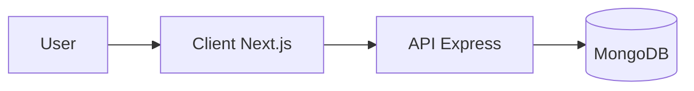

# Restaurant Management System POS

A full-stack **Restaurant Management System / Point of Sale (POS)** monorepo built with Turborepo
and TypeScript. It includes an Express API, a Next.js POS/dashboard client, and shared UI and
tooling.

## Features

- **Authentication** — Login with JWT (access token), role-based access. Seed creates default admin:
  `admin@restaurant.com` / `admin123`.
- **Users** — User CRUD and management.
- **Categories & Menu** — Category CRUD; menu items with name, price, category, and image upload
  (Cloudinary).
- **Tables** — Table management (name, capacity, status) for dine-in.
- **Orders** — Create and update orders (dine-in or takeaway) with line items; status flow: pending
  → preparing → ready → served → completed (or cancelled); order number, subtotal, tax, discount,
  total.
- **Payments** — Record payments linked to orders (method, amount, status).
- **Settings** — Restaurant settings (name, address, phone, email, tax %, service charge %,
  currency).
- **Dashboard & Analytics** — Today’s sales/orders, active orders, total revenue, payment summary;
  charts for revenue trend (7/30 days), sales by category, payment method, order status, hourly
  orders, top-selling items, and weekly comparison (this week vs last week).
- **Client UI** — Login, dashboard with stats and charts, Menu, Orders, Tables, Payments, Users, and
  Settings pages; theme toggle; protected routes. The client serves as both POS and admin dashboard
  (no separate admin app).

## Tech Stack

- **Backend**: Express 5, MongoDB (Mongoose), JWT auth, Zod validation, file upload
  (Multer/Cloudinary), Winston logging, Helmet, CORS, compression.
- **Frontend**: Next.js 16 (App Router), TanStack Query, Zustand, Chart.js, shared `@workspace/ui`
  (Radix UI, Tailwind).

## Architecture



## Folder Structure

```
restaurant-management-system-pos/
├── apps/
│   ├── client/          # Next.js 16 POS/dashboard (port 3000)
│   │   ├── app/         # App Router: (auth)/login, (dashboard)/* (layout, page, menu, orders, tables, payments, users, settings)
│   │   ├── components/  # layout (sidebar, header), forms, charts, auth (protected-route)
│   │   ├── hooks/       # use-auth, use-orders, use-dashboard, use-menu-items, use-tables, etc.
│   │   ├── lib/         # api (client, auth, orders, menuItems, ...), types, utils
│   │   └── stores/      # Zustand: authStore, orderStore, settingsStore, uiStore
│   └── server/          # Express API (port 5000)
│       ├── src/
│       │   ├── app.ts, server.ts
│       │   ├── config/     # env, db
│       │   ├── middleware/ # verifyAuth, validateRequest, fileUpload, globalErrorHandler, notFound
│       │   ├── modules/    # auth, user, category, menuItem, table, order, payment, settings, dashboard
│       │   │   └── <module>/  # *.model, *.routes, *.controllers, *.service, *.validators
│       │   ├── routes/     # index (mounts /auth, /users, /categories, /menu-items, /tables, /orders, /payments, /settings, /dashboard)
│       │   ├── lib/        # ApiResponse, asyncHandler, httpStatus
│       │   ├── utils/      # logger, PasswordUtil, AuthToken, errorHandler/*
│       │   └── scripts/    # seed.ts
│       └── default.env    # env template
├── packages/
│   └── ui/               # @workspace/ui – shared components (Radix, Tailwind), used by client
├── tools/                # Shared configs: typescript, eslint, prettier, tailwindcss
├── package.json, pnpm-workspace.yaml, turbo.json
└── README.md
```

## Prerequisites

- **Node.js** >= 20
- **pnpm** (package manager: `pnpm@9.0.0`)
- **MongoDB** (local or cloud)

## Run Locally

1. **Clone and install**

   ```bash
   git clone <repo-url> && cd restaurant-management-system-pos
   pnpm install
   ```

2. **Server environment**

   In `apps/server/`, copy `default.env` to `.env`. Set at least:
   - `LOCAL_MONGO_URI` or `CLOUD_MONGO_URI` (e.g. `mongodb://localhost:27017/restaurant-pos`)
   - `JWT_ACCESS_SECRET` (required for auth)

   Optional: `PORT` (default 5000), `NODE_ENV`, `LOG_LEVEL`, `CORS_ORIGIN` (default `*`).

3. **Seed database (recommended)**

   From repo root:

   ```bash
   pnpm --filter server run seed
   ```

   Or from `apps/server`: `pnpm run seed`. Creates default admin and restaurant settings if missing.

4. **Client environment (optional)**

   If the API is not at `http://localhost:5000`, set `NEXT_PUBLIC_API_URL` in
   `apps/client/.env.local` (e.g. `http://localhost:5000/api/v1`).

5. **Run**

   All apps:

   ```bash
   pnpm dev
   ```

   Or run separately: `pnpm dev:server` and `pnpm dev:client` in different terminals.

6. **Access**
   - **Client**: http://localhost:3000
   - **API base**: http://localhost:5000/api/v1
   - **Health**: http://localhost:5000/health

## Run with Docker Compose

Run the full stack (MongoDB, API, client) in containers.

**Prerequisites:** Docker and Docker Compose.

1. Copy `.env.example` to `.env` and set `JWT_ACCESS_SECRET` (and any overrides):

   ```bash
   cp .env.example .env
   # Edit .env and set JWT_ACCESS_SECRET
   ```

2. Build and start all services:

   ```bash
   docker compose up --build
   ```

   To run in the background: `docker compose up -d --build`.

3. **Access**
   - **Client**: http://localhost:3000
   - **API base**: http://localhost:5000/api/v1

   The server entrypoint runs the seed on startup, so the default admin is created if missing. Log
   in with **admin@restaurant.com** / **admin123**.

4. **Re-seed** (optional): To run the seed again (e.g. reset admin/settings):

   ```bash
   docker compose run --rm server node dist/scripts/seed.js
   ```

## Scripts

| Script              | Description                                 |
| ------------------- | ------------------------------------------- |
| `pnpm dev`          | Run all applications in development mode    |
| `pnpm dev:server`   | Run the server only (port 5000)             |
| `pnpm dev:client`   | Run the client only (port 3000)             |
| `pnpm build`        | Build all applications and packages         |
| `pnpm lint`         | Lint all packages and applications (ESLint) |
| `pnpm check-types`  | Type-check all packages                     |
| `pnpm format`       | Format code with Prettier                   |
| `pnpm format:check` | Check formatting with Prettier              |

## Application Ports

- **Server**: http://localhost:5000
- **Client**: http://localhost:3000

## Workspace Packages

- **apps/server** — Express.js API (auth, users, categories, menu items, tables, orders, payments,
  settings, dashboard).
- **apps/client** — Next.js POS/dashboard (the single frontend; no separate admin app).
- **packages/ui** — Shared UI component library (`@workspace/ui`), used by the client.
- **tools/** — Shared configs: `typescript`, `eslint`, `prettier`, `tailwindcss`.
